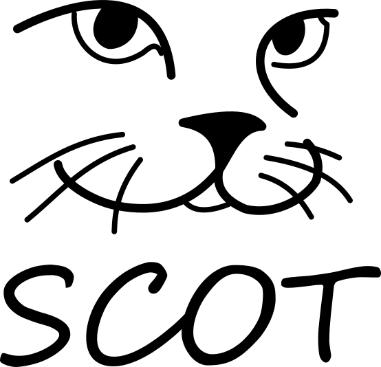

# Project SCOT

<!-- github.com/sjoon-oh/scot
Author: Sukjoon Oh, sjoon@kaist.ac.kr -->

Simple Dependency-check Offloading Replication Technique (**SCOT**) is a consensus layer for any application.

SCOT is just a prototype for now. It targets clusters with InfiniBand based RDMA RC communication. Any other features may be added in the future. The connection module the project uses is [hartebeest](https://github.com/sjoon-oh/hartebeest). For more information, please refer to the repository link.

The binary was tested on:
- CentOS7, 5.11.1-1.el7.elrepo.x86_64
- Mellanox Driver 5.7-1.0.2.0-rhel7.9-x86_64
- Mellanox ConnectX-5

This document briefly describes the project. Author: Sukjoon Oh, [sjoon@kaist.ac.kr](mailto:sjoon@kaist.ac.kr).

## Description

<!-- 
cmake . -DCMAKE_BUILD_TYPE=Debug
 -->

